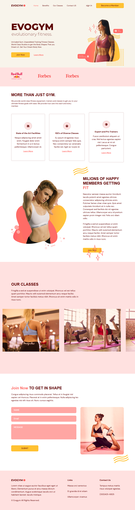

# 🏋️ Gym Landing Page

A modern, responsive **fitness landing page** built with **React, TypeScript, Vite, and TailwindCSS**.  
This project demonstrates clean component-based architecture, modular sections, TypeScript typing, and a professional Git branching workflow.  

 
*(Replace with a real screenshot of your app)*

---

## 🚀 Tech Stack

- ⚛️ React 18  
- 🟦 TypeScript  
- ⚡ Vite  
- 🎨 TailwindCSS  
- 🔀 Git & GitHub (feature-branch workflow)

---

## ✨ Features

- ✅ **Responsive Navbar** with active section highlight  
- ✅ **Hero Section** with CTA and layout  
- ✅ **Benefits Section** with reusable card components  
- ✅ **Our Classes Section** with grid-based layout  
- ✅ **Contact Form** with validation  
- ✅ **Footer** with consistent design  
- ✅ **Branching workflow** (`feat/...`, `chore/...`) showcasing professional Git usage  

---

## 📂 Project Structure

src/
┣ components/ # Reusable UI components
┣ scenes/ # Page sections (Home, Benefits, Classes, Contact, Footer)
┣ shared/ # Types, constants, and shared utilities
┣ App.tsx # Main app assembly
┗ main.tsx # Entry point


---

## 🛠️ Getting Started

Clone the repo and run locally:

```bash
# Clone repository
git clone https://github.com/YoussefAsaad7/gym-landing-page.git

# Move into project folder
cd gym-landing-page

# Install dependencies
npm install

# Start development server
npm run dev


🌍 Deployment

Deployed with Vercel / Netlify.

👉 Live Demo: your-app-link.vercel.app
(Replace with your actual link once deployed)

📖 Learning Outcomes

Through this project I practiced:

- Structuring a React + TypeScript project with modular architecture

- Writing typed props & interfaces for components

- Managing feature branches with conventional commits and pull requests

- Building responsive layouts with Tailwind

- Following a real-world Git workflow (feature branches → PR → merge → delete)

🔮 Future Improvements

- Add smooth animations with Framer Motion

- Connect Contact Form to a backend (e.g., Node.js / Firebase)

- Integrate a CMS (Sanity / Contentful) for dynamic content

- Add unit tests with Jest + React Testing Library

👤 Author

Yussef Asaad

GitHub: @YoussefAsaad7

LinkedIn: https://www.linkedin.com/in/yussef-asaad-1603031b4/